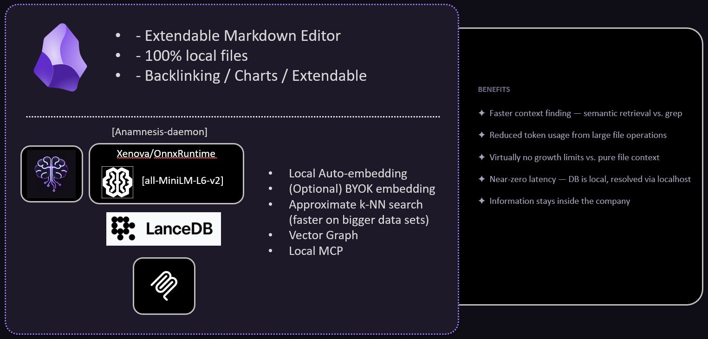
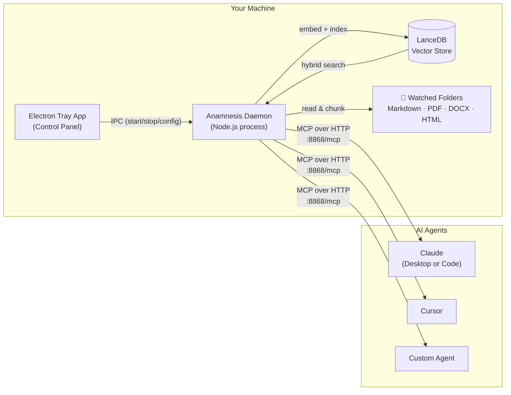

# Anamnesis Standalone


**Anamnesis** is a local-first semantic search engine and [MCP](https://modelcontextprotocol.io) server for your personal knowledge base. It runs as a background daemon on your machine, indexes your notes and documents, and exposes a search API that any MCP-compatible AI agent — Claude, Cursor, or your own tools — can query in natural language.

No cloud. No subscriptions. Your files never leave your machine.

> Also available as an **Obsidian plugin**: [github.com/Chepech/anamnesis](https://github.com/Chepech/anamnesis)  
> The plugin embeds the same daemon inside Obsidian; this standalone app lets you use it independently of any editor.

---

## What it does

- **Watches your folders** for new and changed files, indexes them automatically in the background
- **Understands your documents** — parses Markdown, PDF, DOCX, and HTML into semantic chunks
- **Hybrid search** — combines dense vector similarity (ONNX embeddings, fully local) with BM25 keyword ranking via Reciprocal Rank Fusion for results that are both semantically relevant and lexically precise
- **Speaks MCP** — exposes a `search_vault`, `read_note`, and `list_indexed_files` tool over HTTP so any MCP-compatible AI agent can query your knowledge base mid-conversation
- **Runs local embeddings** by default (no API key needed) using `all-MiniLM-L6-v2` via `@xenova/transformers`, or optionally delegates to OpenAI's `text-embedding-3-small`
- **Multiple vaults, multiple sources** — watch as many directories as you want simultaneously: an Obsidian vault, a folder of PDFs, a research directory, a work notes folder — all indexed together into one searchable corpus



---

## How to use it

### 1. Install

Download the latest release for your platform from the [Releases](../../releases) page:

| Platform | File |
|---|---|
| Windows | `Anamnesis-Setup-x.x.x.exe` |
| macOS | `Anamnesis-x.x.x.dmg` |
| Linux | `Anamnesis-x.x.x.AppImage` or `.deb` |

Install and launch. The app lives in your system tray — no dock icon, no window that gets in your way.

### 2. Add your folders

Open the control panel from the tray icon. On the **Dashboard** tab, add the directories you want indexed: your Obsidian vault, a notes folder, a PDF library, anything. The daemon starts watching and indexing immediately.

### 3. Connect an AI agent

Point any MCP-compatible agent at:

```
http://127.0.0.1:8868/mcp
```

The daemon exposes three tools:

| Tool | What it does |
|---|---|
| `search_vault` | Hybrid semantic + keyword search. Returns ranked chunks with file paths and scores. |
| `read_note` | Reads the full content of any indexed file by path. |
| `list_indexed_files` | Lists all indexed files and their chunk counts. |

#### Claude Desktop config example

```json
{
  "mcpServers": {
    "anamnesis": {
      "url": "http://127.0.0.1:8868/mcp"
    }
  }
}
```

#### Claude Code `.mcp.json` example

```json
{
  "mcpServers": {
    "anamnesis": {
      "type": "http",
      "url": "http://127.0.0.1:8868/mcp"
    }
  }
}
```

---

## Architecture



The **Electron app** is a thin shell — it launches the daemon, shows status, and lets you manage config. The **daemon** is a standalone Node.js process that does all the real work: watching, parsing, embedding, indexing, and serving the MCP endpoint. Because the two are separate processes, the daemon can run headlessly if you prefer; the tray app is optional for power users.

---

## Why this matters: the knowledge-augmented agent

This architecture directly supports the pattern Andrej Karpathy describes as working with AI agents against a personal wiki — giving agents access to your accumulated knowledge as a first-class tool rather than pasting context manually.

> "The key idea is to maintain a personal wiki of notes that an LLM can search through. The LLM becomes dramatically more useful when it can retrieve relevant context from your personal knowledge base on demand."  
> — [Karpathy's note-taking + AI methodology](https://gist.github.com/karpathy/442a6bf555914893e9891c11519de94f)

With Anamnesis running, every conversation with Claude or any MCP-compatible agent has access to `search_vault` — it can pull in the exact notes, documents, and context relevant to what you're working on, without you having to paste anything. Your knowledge base becomes an ambient resource your agents can consult.

**Practical advantages:**

- **No copy-paste context** — the agent retrieves what it needs, when it needs it
- **Works across all your tools** — Claude Desktop, Claude Code, Cursor, custom scripts — all share the same index
- **Grows with your notes** — new files are indexed within seconds of being saved; no manual re-indexing
- **Private by default** — embeddings are computed locally; the index never leaves your machine

---

## Supported file types

| Format | Notes |
|---|---|
| `.md` | Markdown — preserves wikilinks and frontmatter in chunk metadata |
| `.pdf` | Text extraction via `pdf-parse` |
| `.docx` | Word documents via `mammoth` |
| `.html` | Web pages via `@mozilla/readability` (off by default, enable in Settings) |

---

## Settings

Open the **Settings** tab in the control panel to configure:

- **Embedding provider** — local ONNX model (default, no API key) or OpenAI
- **Local model** — choose between speed (`paraphrase-MiniLM-L3-v2`) and quality (`all-mpnet-base-v2`)
- **Chunk size and overlap** — controls how documents are split for indexing
- **File types** — which extensions to index
- **Auto-index on change** — debounce delay for re-indexing modified files
- **Exclude patterns** — glob patterns to skip (`.git`, `node_modules`, etc.)
- **Hybrid search** — toggle BM25+vector fusion; adjust importance weight
- **MCP port** — default `8868`; change if there's a conflict

---

## Building from source

Requires Node.js 22+ and pnpm 10+.

```bash
git clone https://github.com/Chepech/anamnesis-standalone
cd anamnesis-standalone
pnpm install
pnpm build
pnpm --filter @anamnesis/app start   # dev mode
```

To produce a native installer, push a version tag — GitHub Actions builds for Linux, macOS, and Windows in parallel and uploads installers to a draft release automatically.

---

## License

MIT
